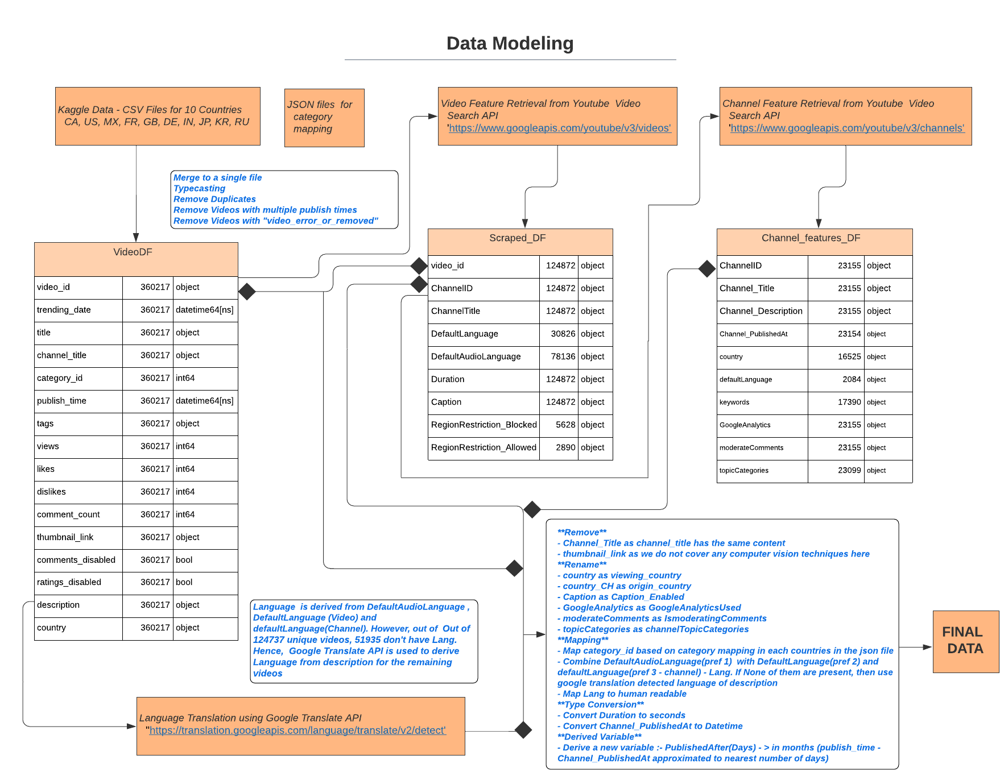
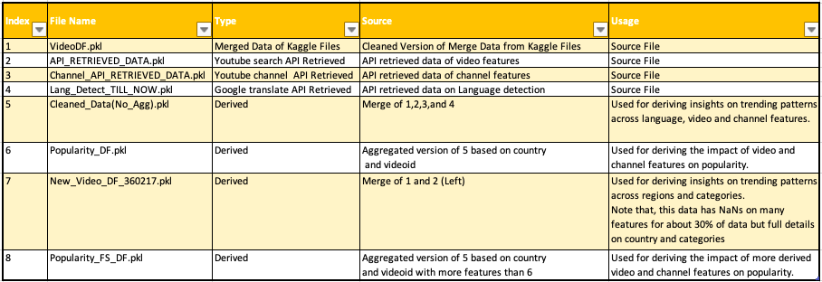
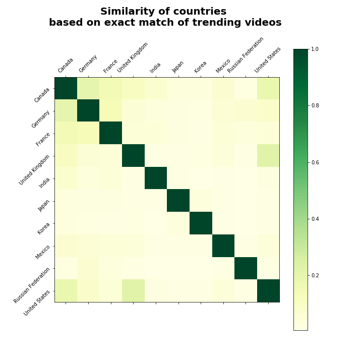
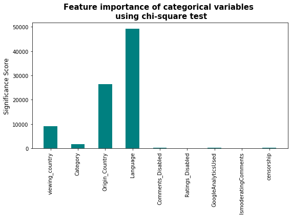
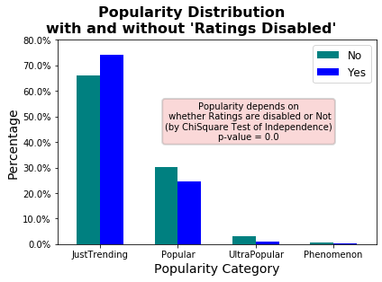
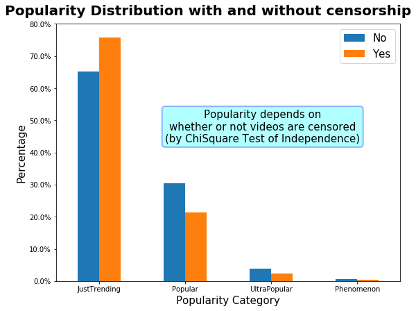
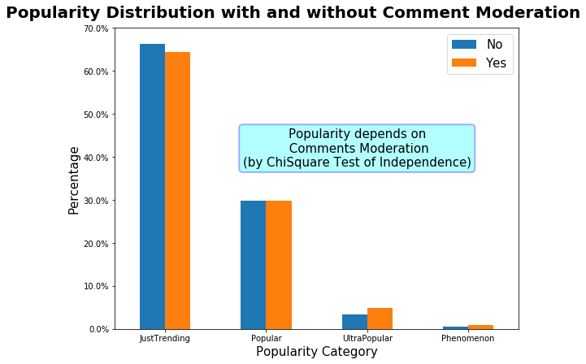
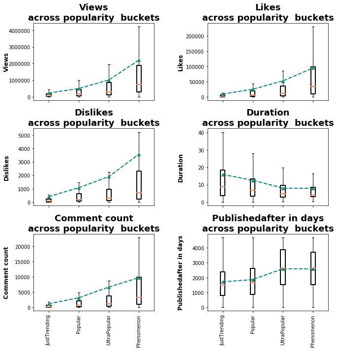
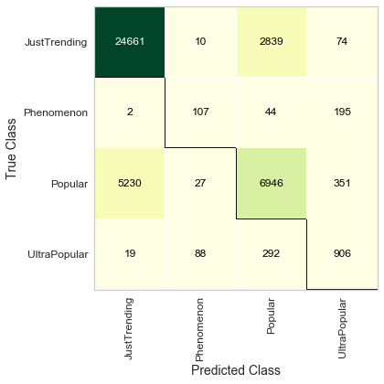

# YouTube Trending

**Before we begin, let us introduce some of the most trending videos on YouTube across the globe!!!**


**After watching a couple of them, we asked ourselves, what makes the videos popular !!! and what if we could predict the popularity !!! 
Afterall, we want to help the struggling youtuber/influencer community by providing them the valuable insights on trending. At the same time, predicting popularity would help the advertising firms to identify the best videos to invest upon.** 

**Above all, we want to know, if there are any interesting insights underlying the trending patterns ?**

**This project is all about our journey towards finding these answers. Stay tuned !!!**


## Team Members

[Bincy Narath](https://github.com/bnarath), [Sogra Bilal Memon](https://github.com/SograMemon) & [Megan McGlashan](https://github.com/McGlash)

## Inspiration:

After finding [this](https://www.kaggle.com/datasnaek/youtube-new) dataset in [Kaggle](https://www.kaggle.com/), we thought of leveraging this data to derive meaningful insights. 

The dataset consists of useful but limited details on the trending videos for a span of 205 days across 10 countries. It is described that "To determine the top-trending videos, YouTube uses a combination of factors including measuring users interactions (number of views, shares, comments and likes)" which is not revealed publicly. Though many interesting explorations were already done by many Kagglers on the same dataset, we identified the opportunity to predict how long videos trend (in other words, video popularity) and identify other behavioural patterns. This was deemed possible by identifying and formulating usecases and solving them by incorporating many more features with API retrieved data, engineering new features, and building efficient models, etc.

## Data Retrieval and Modelling:

The Data Retrieval and Modelling of this project are explained in the below ERD(Entity Relationship Diagram)



Many dataframes were created with this data for various analyses and model building. Because of the file size limits in GitHub, the dataframes were uploaded [here](https://drive.google.com/drive/folders/1ovyTyDPmwY9NIAqOC7C4y1SWwoec3Nmj?usp=sharing) as pickle files. Please refer the table below for the details on the files.




### Codebase for Data Retrieval and Cleanup
We separated out the codebase of data modelling and clean-up from analysis and the model. Please refer the codebase for data retrieval and clean-up [here](youtube-trending/Code/youtube_trending_preprocessing.ipynb).

## Research Questions

1. Regional Analysis: How does trending in different countries impact one another?
    1. Which countries generate videos that trend on Youtube and which consume them?
    1. How similar or different are the countries based on which videos trend?
    1. Which categories of videos trend more often in different countries? 
    1. What languages are used in trending videos, and how does the distribution by language used compare between countries?
    1. To what categories do trending videos belong to, and how does the distribution by category compare between countries?
   

1. Popularity Analysis: What impacts how long videos trend on Youtube? 
    Factors considered:
     1. Country of viewership 
     1. Video language 
     1. Video features
     1. Interval between publishing and when videos first trending  

## Regional Analysis: Findings

### Codebase for Analysis
Please refer the codebase for all the analysis [here](youtube-trending/Code/Analysis_Code_Final.ipynb).

###  Country of Viewership:

**Overall, the vast majority (92.5%) of videos trended in a single country.**


<hr>

**When videos trended in multiple countries, they most often trended in Canada (over 1 in 4) followed by Germany (over 1 in 5) and France (just under 1 in 6).**


<hr>

###  Similarity between countries based on what they watch:

**We mapped countries into large dimensional vectors and measured cosine similarity between them to understand which countries watch the same content.**

<br>



**It appears that all countries watch mostly distinct videos. When, only countries with at least 10% similarity is taken into account, it shows Canada is similar to all other interconnected countries. This shows cross culture links in Canada (possibly because of welcoming Immigration across the globe)**


<hr>


###  Similarity between countries based on the categories they watch:

* **We studied trending categories across countries and found "Entertainment" is the most trending category in all countries except Great Britain(GB) and Russia. In GB, Music outnumbered the Entertainment whereas in Russia "People & Blogs" surmounted Entertainment!** 

* **We clustered countries based on the how much they watch in each categories. The clustering method we chose is hierarchical clustering as we have only 10 countries to compare**
 - **Cluster1 - Canada, Germany, France, India, Japan and Mexico  - Significantly high interest in Entertainment compared to all other categories**
 - **Cluster2 - Korea & Russia - Along with Entertainment, they also have interest in News & Politics and People & Blogs**
 - **Cluster3 - UK & US - Common interest in Music & Entertainment**


<hr>


###  Origin of Videos:

**Most video have an unknown origin. Of those that do, the highest proportion originate from the US** 

<hr>


**Videos that trend in Canada, Germany, France and Russia originate from over 70 countries.** 

 


<hr>


**Few videos that trended in Canada and the UK originated from within the respective countries, rather most videos that trended in these countries orignated in the US. Comparatively, most videos that trended in other countries originate from within the respective countries.**


<hr>


###  Origin of Trending amoung Videos Trending in Multiple Countries: 

**The vast majority of videos trended in multple countries first did so on same day across countries. This suggests that there is no single regional origin of trending for the majority of videos that trend in multiple countries.** 


<hr>


###  Language: 

**As we would expect, the local language seems to play a big role in trending.**   

**We studied the ratio of languages used in trending videos across countries. English is amoung top 3 most common for all except Russia, Japan and Korea.**


<hr>


**Also, Videos made in English trended significantly longer than that of other languages.**


<hr>

###  Category:  

**We studied trending categories across countries and found "Entertainment" is the most trending category in all countries except Great Britain(GB) and Russia.**  **In GB, "Music" outnumbered "Entertainment" whereas in Russia "People & Blogs" surmounted "Entertainment"!**


<hr>


**We define popularity(longevity) as the number the days of trending**
- **Almost all categories have a varying popularity**
- **However, it looks like "Music videos" tend to have relatively longer limelight (Avg >3, whereas all other categories have mean trending days <3)**


<hr>


<br>
<br>

## Popularity Analysis: Findings

###  Pattern of Trending: 

**Trending videos tend to trend on consecutive days: 99% of the trends were continuous without a break and there is very high correlation (0.98) between the total trend days and the maximum of  continuous trend days show.**


<hr>

###  Country of Viewership:

**The more countries videos trended in, the greater the proportion that trended for more than a single day.**


<hr>


**For six of ten countries, the majority of videos trended for a single day. In Korea, just under half of videos trended for 2 to 5 days whereas over half of videos in India trended for that interval. US and UK are outliers amoung the countries as the majority of videos that trended in these countries did so for more than five days.** 


<hr>

**The maximum number of days video trended per Country was as follows:**
- Videos trend in UK from 1 to 38 days
- Videos trend in US from 1 to 29 days
- Videos trend in India from 1 to 10 days
- Videos trend in Canada from 1 to 8 days
- Videos trend in all other countries for less than 8 days


<hr>

###  Top Trending Videos Vs. Viewing Countries

**There is a very large difference in the number of days videos trend in UK compared to other countries. Each of the longest trending videos trended for the longest period of time in the UK; The longest trending videos trended in the UK for 38 days. In comparison, these videos only trended for 0 to 6 days in most other countries and trended for about 10 to 20 days in the US.** 

**This raises the question: do all occurrences of total trending days that are higher than 20 occur in UK ? If this is the case why does this happen?**


<hr>

###  Feature Importance: Statistical Approach
**We used statistical measures to understand the prominent features (attributes) that affects popularity (No. of days of trending)**
- **Since the number of days of trending(popularity), we cannot treat this problem as a regression problem and use statistical methods. Hence, we have categorized the popularity into 4 ranges**
 - 1Day Trending -> 'JustTrending'
 - 1 to 5 Days Trending-> 'Popular'
 - 5 to 14 Days Trending -> 'UlraPopular'
 - \>14 Days Trending -> 'Phenomenon'
- **Used Chi-squared Feature Selection for categorical features**
- **Use ANOVA test for numeric features**
  - **Assumptions: We don't have normality, however, if that is accepted if the sample size in each group is above 20 (It holds true in our case)**


**Please note that this study doesn't identify the combined effects of attributes on output**

<br>

<p float="left">
  
   
</p>

<br>

**Based on the feature selection study, it appears that Boolean Categorical variables are less significant than others. However, the manual chi-square test of independence proved that the popularity depends on all of the boolean variables**

- **Disabling the Ratings, Comments and having Censorship reduces the trending days, as we can see in the distribution plot (moves towards the left)** 


<p float="left">
  
  
   
</p>

<br>

- **Enabling Google Analytics and Moderating comments benefits the popularity, as we can see in the distribution plot (moves towards the right)** 


<p float="left">
  
   
</p>

<hr>

**One way ANOVA Test on Quantitative Variables for Popularity Bucket**
- **The F-value scores examine if, when we group the quantitative variables by the popularity bucket, the means for each group are significantly different.**
- **This result also shows that all the mean values (of all of the quantitative variables) across the popularity buckets are not the same**
- **Ultra Popular videos have higher mean and median values for views, likes, dislikes, comment counts, and the channel age (Publish after days) compared to the low popular classes.**
- **At the same time, Ultra Popular videos have lower mean and median values of duration compared to the low popular classes.**

```python
st.f_oneway(*[DF[DF['Popularity_Category']==bucket][['Trended_After(Days)','Duration', 'Views', 'Likes', 'Dislikes', 'Comment_Count', 'PublishedAfter_in_Days']] for bucket in pop_buckets])

F_onewayResult(statistic=array([ 126.25689231,  503.74984728, 1851.59958288, 1376.40544717,
        481.38935889,  710.69884855, 1021.07865493]), pvalue=array([1.13317581e-081, 0.00000000e+000, 0.00000000e+000, 0.00000000e+000,
       3.14170798e-311, 0.00000000e+000, 0.00000000e+000]))
```



<hr>

###  Time To trend Vs Trending Days: 

**Most of the videos trended within a month of being published. Few videos were lateblooms!**
**The so called "latebloom effect": Given that a latebloom video is trending, the chance of this video trends >5 days increases with its age!! This shows some light on the external factors behind a video trending**


<p float="left">
  
   
</p>


<hr>

## Model Building: Base Model

### Codebase for the model building
Please refer the codebase for the base model [here](youtube-trending/Code/Basic_Model.ipynb).

- **We have selected the features based on the insights from the statistical analysis to predict the popularity bucket of a trending video**
- **"Total Trending Days" is categorized into Popularity as follows:**
  - **1Day Trending -> 'JustTrending'**
  - **1 to 5 Days Trending-> 'Popular'**
  - **5 to 14 Days Trending -> 'UltraPopular'**
  - **>14 Days Trending -> 'Phenomenon'**
 
- **One hot encoding is done for all categorical variables**

- **There are total 68 features in the model as follows**
    ```python
            ['Duration', 'Views', 'Likes', 'Dislikes', 'Comment_Count',
           'Trended_After(Days)', 'PublishedAfter_in_Days',
           'Category_Autos & Vehicles', 'Category_Comedy', 'Category_Education',
           'Category_Entertainment', 'Category_Film & Animation',
           'Category_Gaming', 'Category_Howto & Style', 'Category_Movies',
           'Category_Music', 'Category_News & Politics',
           'Category_Nonprofits & Activism', 'Category_People & Blogs',
           'Category_Pets & Animals', 'Category_Science & Technology',
           'Category_Shows', 'Category_Sports', 'Category_Trailers',
           'Category_Travel & Events', 'Language_Arabic', 'Language_English',
           'Language_French', 'Language_German', 'Language_Hindi',
           'Language_Icelandic', 'Language_Japanese', 'Language_Korean',
           'Language_Others', 'Language_Russian', 'Language_Spanish',
           'Language_Turkish', 'Language_Unknown', 'viewing_country_CA',
           'viewing_country_DE', 'viewing_country_FR', 'viewing_country_GB',
           'viewing_country_IN', 'viewing_country_JP', 'viewing_country_KR',
           'viewing_country_MX', 'viewing_country_RU', 'viewing_country_US',
           'Origin_Country_CA', 'Origin_Country_DE', 'Origin_Country_ES',
           'Origin_Country_FR', 'Origin_Country_GB', 'Origin_Country_IN',
           'Origin_Country_JP', 'Origin_Country_KR', 'Origin_Country_MA',
           'Origin_Country_MX', 'Origin_Country_Not_Disclosed',
           'Origin_Country_Others', 'Origin_Country_RU', 'Origin_Country_TR',
           'Origin_Country_UA', 'Origin_Country_US', 'Comments_Disabled_True',
           'Ratings_Disabled_True', 'GoogleAnalyticsUsed_True',
           'IsmoderatingComments_True'],
    ```

- **Total data is split into Train and Test at a ratio of 70%-30%**

- **Built a base model with XGBoost Classifier**

- **Train accuracy - 82.55%, Test accuracy - 78.05%**

- **Confusion Matrix shows that the misclassified data is mostly the adjacent class**

   

<hr>

## Future Scope - These are the possible directions we would like to expand!

- **To work on the complete interpretability of the model.**
- **To incorporate Natural Language into the model by analysing and deriving insights on description, tags etc.**
- **To work on the model tuning by comparing multiple classifiers.**
- **To build a deployable model as an application.**

