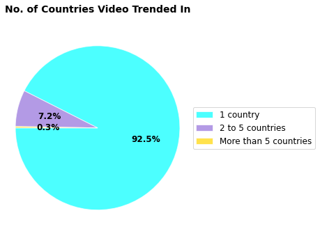

# YouTube Trending

## Team Members

[Bincy Narath](https://github.com/bnarath), [Sogra Bilal Memon](https://github.com/SograMemon) & [Megan McGlashan](https://github.com/McGlash)

## Inspiration:

After finding [this](https://www.kaggle.com/datasnaek/youtube-new) dataset in [Kaggle](https://www.kaggle.com/), we thought of leveraging this data to derive meaningful insights. 

The Data set is consists of information about the trending videos for a span of 205 days across 10 countries. "To determine the top-trending videos, YouTube uses a combination of factors including measuring users interactions (number of views, shares, comments and likes)"

## Data Path:
Cleaned and merged Data is uploaded [here: name-Popularity_DF.pkl](https://drive.google.com/drive/folders/1ovyTyDPmwY9NIAqOC7C4y1SWwoec3Nmj?usp=sharing) as a pickle file (due the file size limitation in github)

## Research Questions

1. Regional Analysis: How does trending in different countries impact one another?
    - Which countries generate videos that trend on Youtube and which consume them?
    - Which categories of videos trend more often in different countries? 

2. Popularity Analysis: What impacts how long videos trend on Youtube? 
  Factors considered:
  - Country of viewership 
  - Video language 
  - Video features
  - Interval between publishing and when videos first trending  

## Findings

Overall, the vast majority (92.5%) of videos trended in a single country.

**For six of ten countries, the majority of videos trend for a single day.** In Korea, just under half of videos trend for 2 to 5 days whereas over half of videos in India trended for that interval. **US and UK are outliers amoung the countries as the majority of videos that trended in these countries did so for more than five days.** 

Videos that trended in multiple countries most often trended in Canada (over 1 in 4) followed by Germany (over 1 in 5) and France (just under 1 in 6). Few Videos that trended in multiple countries trended in the US, suggesting it has less impact on trending in other countries.     

# Framing Popularity

**What is typically the pattern of trend ? Is it continuous trending or sporadic ?**
**Trending videos show a continuous trend rather than intermittent**

**A very high correlation (0.98) between the total trend days and the maximum of  continuous trend days show Trending is a continuous pattern** 
**Also, 99% of the trends is continuous without a break and only 1% had a break in trending**

