# YouTube Trending

## Team Members

[Bincy Narath](https://github.com/bnarath), [Sogra Bilal Memon](https://github.com/SograMemon) & [Megan McGlashan](https://github.com/McGlash)

## Inspiration:

After finding [this](https://www.kaggle.com/datasnaek/youtube-new) dataset in [Kaggle](https://www.kaggle.com/), we thought of leveraging this data to derive meaningful insights. 

The Data set is consists of information about the trending videos for a span of 205 days across 10 countries. "To determine the top-trending videos, YouTube uses a combination of factors including measuring users interactions (number of views, shares, comments and likes)"

## Data Path:
Cleaned and merged Data is uploaded [here: name-Popularity_DF.pkl](https://drive.google.com/drive/folders/1ovyTyDPmwY9NIAqOC7C4y1SWwoec3Nmj?usp=sharing) as a pickle file (due the file size limitation in github)

## Research Questions

1. Regional Analysis: How does trending in different countries impact one another?
    - Which countries generate videos that trend on Youtube and which consume them?
    - Which categories of videos trend more often in different countries? 
    - What is the composition of languages on trending videos across countries?
    - What is the composition of categories on trending videos across countries?

2. Popularity Analysis: What impacts how long videos trend on Youtube? 
  Factors considered:
  - Country of viewership 
  - Video language 
  - Video features
  - Interval between publishing and when videos first trending  
  

## Regional Analysis: Findings

**Overall, the vast majority (92.5%) of videos trended in a single country.**

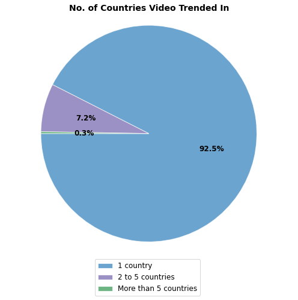

Videos that trended in multiple countries most often trended in Canada (over 1 in 4) followed by Germany (over 1 in 5) and France (just under 1 in 6). Few Videos that trended in multiple countries trended in the US, suggesting it has less impact on trending in other countries.   

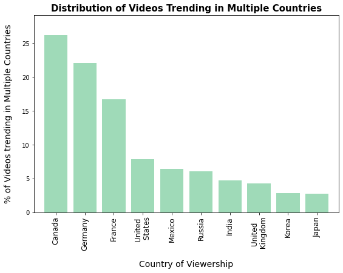

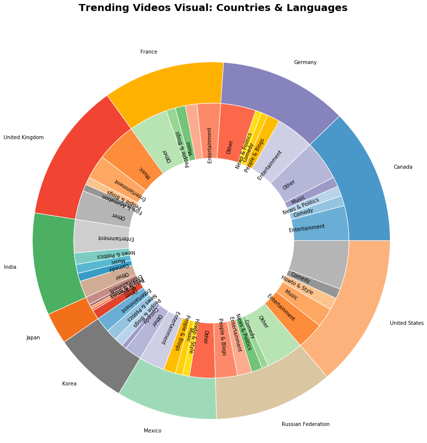

As we would expect, The local language seems to play a big role in trending. We studied the ratio of languages of trending videos across countries (English is Top3 for all except Russia, Japan and Korea). 

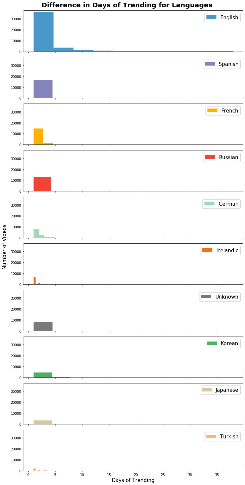

Videos made in English trend significantly longer than that of other languages.

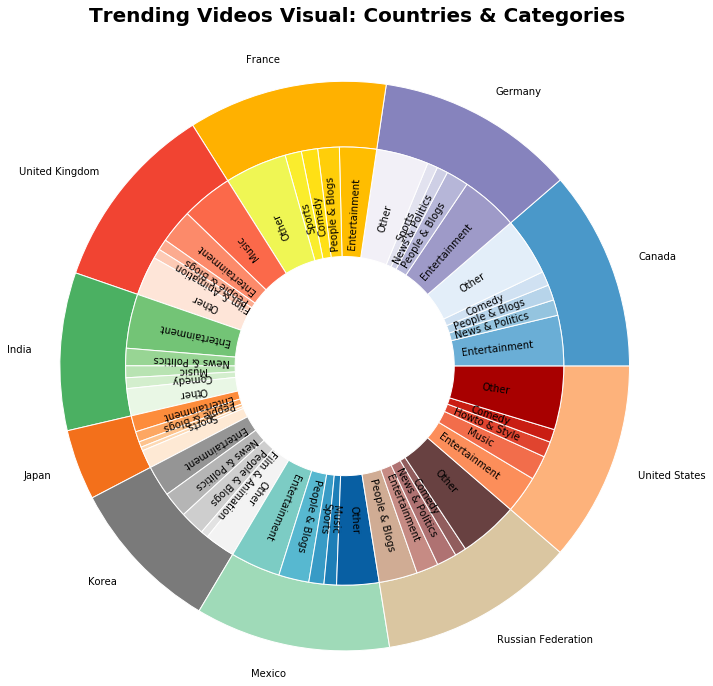

We studied trending categories across countries and found "Entertainment" is the most trending category in all countries except Great Britain(GB) and Russia. In GB, Music outnumbered the Entertainment whereas in Russia "People & Blogs" surmounted Entertainment!

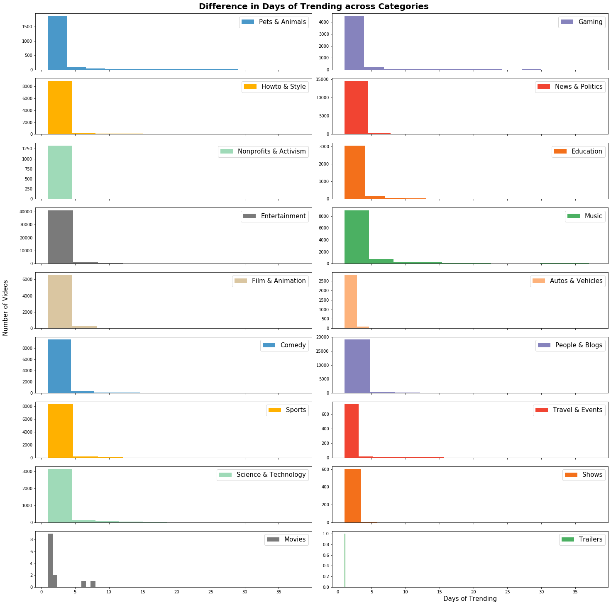

We define popularity(longevity) as the number the days of trending. Almost all categories have a varying popularity
However, it looks like "Non-profit & Activism" tend to have relatively shorter limelight.

**Similarity between countries based on what they watch**
We mapped countries into large dimensional vectors and measured cosine similarity between them to understand with countries watch the same content. It appears that all countries watch mostly distinct videos. When,  only countries with at least 10% similarity is taken into account, it shows Canada is similar to all other interconnected countries. This shows cross culture links in Canada (possibly Immigration)

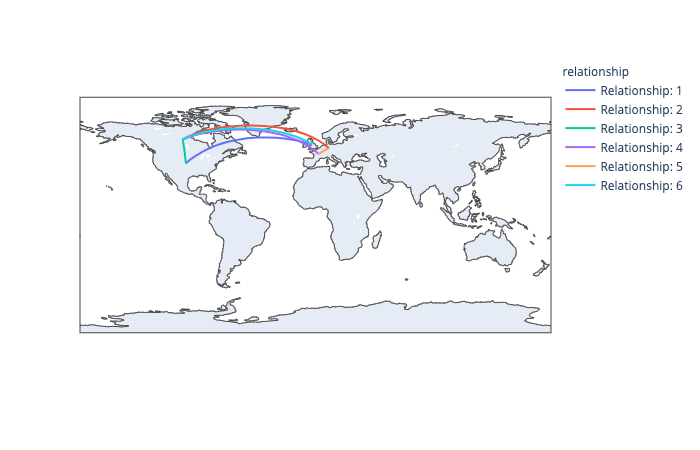

**Similarity between countries based on the categories they watch**
We clustered countries based on the how much they watch in each categories. The clustering chosen is hierarchical  as we have only 10 countries to compare

Cluster1 - Canada, Germany,and India - Common interest in Entertainment, News & Politics
Cluster2 - Japan, Mexico & France - Common interest in Entertainment, People&Blogs, Sports
Cluster3 - Korea & Russia - Common interest in Entertainment, News & Politics, People&Blogs
Cluster4 - UK & US - Common interest in Entertainment, Music

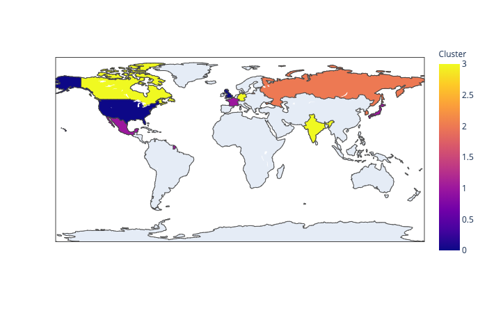

**Origin of Videos**
Most video have an unknown origin. Of those that do, the highest proportion originate from the US. 

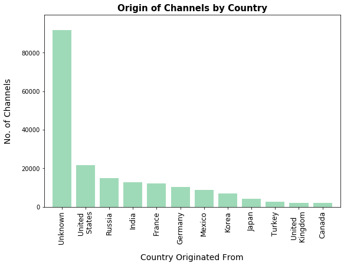

Canada, Germany and France watch videos originating from over 80 known countries. 

 
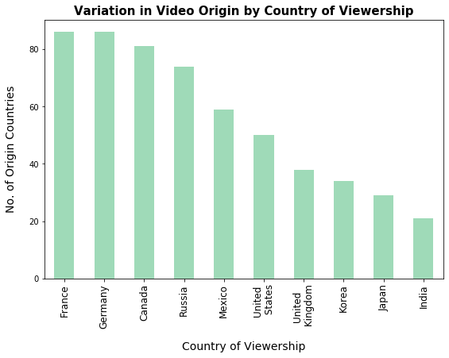

Canada and the UK watched little content known to originate from within the respective countries, rather most videos watched in these countries orignate in the US. Comparatively, most videos watched in other countries originate from within the respective countries.

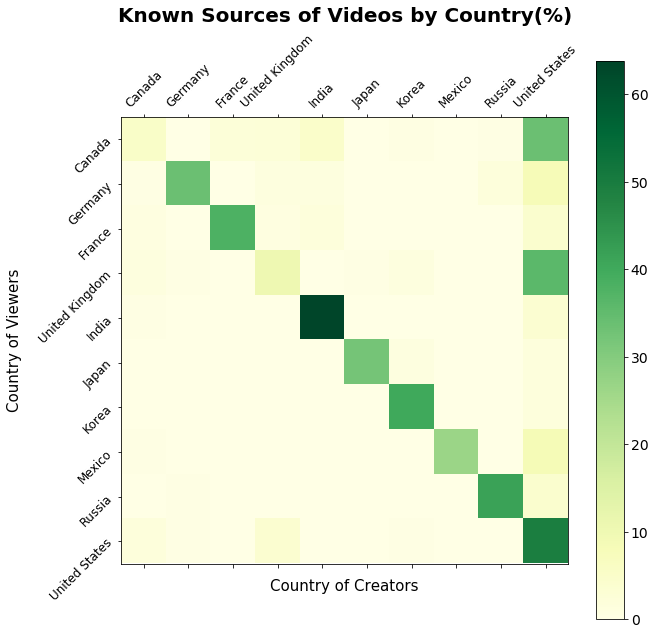

**Impact of trending in one region on trending in Others**

Just under 8 in 10 videos that trended in multple countries first did so on same day across countries. This suggests that there is no single regional origin of trending for the majority of videos that trend in multiple countries. 

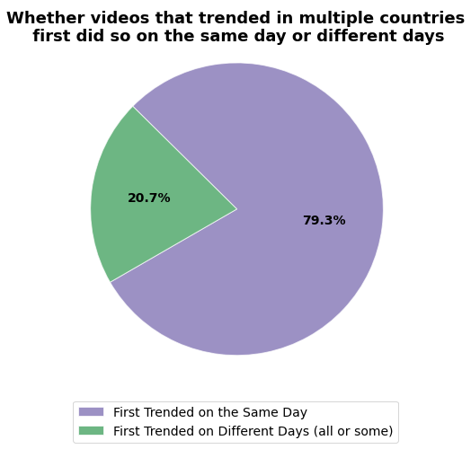

## Popularity Analysis: Findings

**What is typically the pattern of trend ? Is it continuous trending or sporadic ?**
**Trending videos show a continuous trend rather than intermittent**

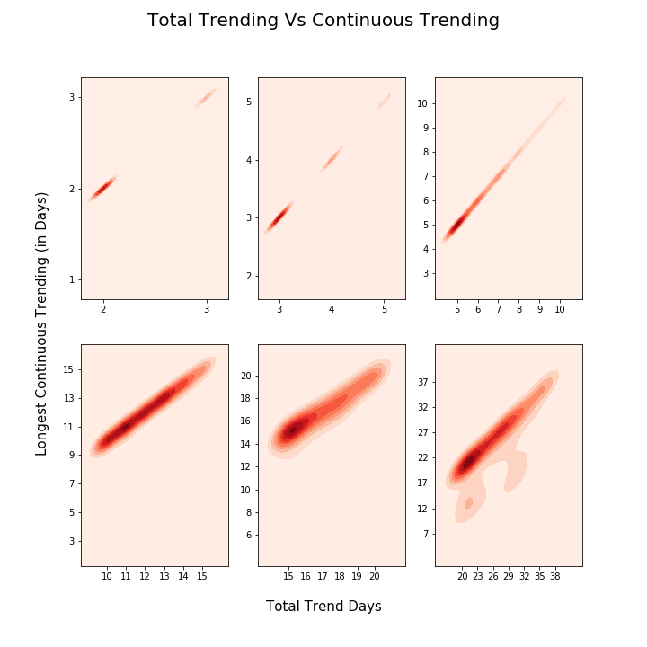

**A very high correlation (0.98) between the total trend days and the maximum of  continuous trend days show Trending is a continuous pattern** 

**Also, 99% of the trends is continuous without a break and only 1% had a break in trending**

The more countries videos trended in, the greater the proportion that trend for more than a single day.

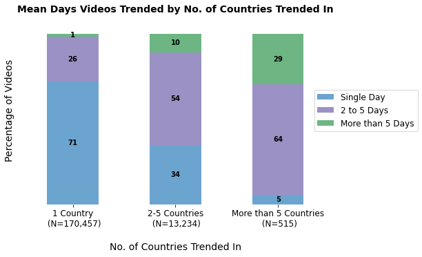

**For six of ten countries, the majority of videos trend for a single day.** In Korea, just under half of videos trend for 2 to 5 days whereas over half of videos in India trended for that interval. **US and UK are outliers amoung the countries as the majority of videos that trended in these countries did so for more than five days.** 

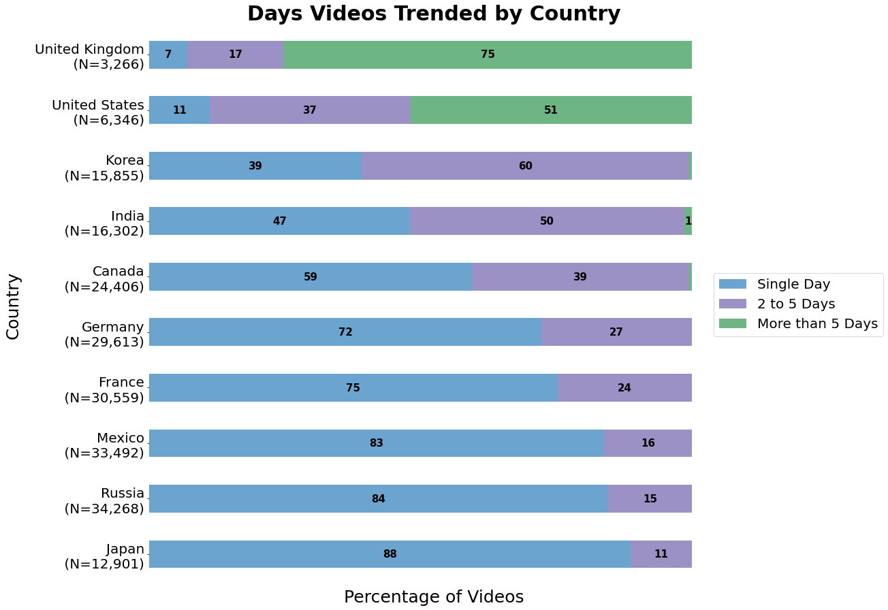

**Maximum Trending days per Country**
* Videos trend in UK from 1 to 38 days
* Videos trend in US from 1 to 29 days
* Videos trend in India from 1 to 10 days
* Videos trend in Canada from 1 to 8 days
* Videos trend in all other countries for less than 8 days

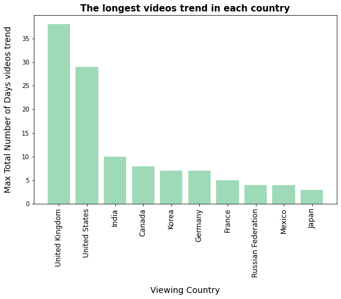

* Each of the top longest trending videos have trended the longest in the UK
* The same videos that achieves such a high popularity in the UK by trending for 38 days only trends for 0 to 6 days in most other countries and in the US trends for about 10 to 20 days 
* There is a very large difference in the number of days videos trend in UK compared to other countries
* This raises the question do all occurrences of total trending days that are higher than 20 occur in UK ? If this is the case why does this happen?

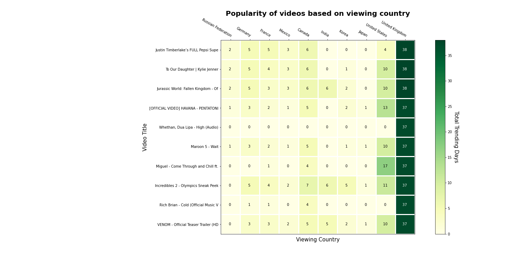

**Time To trend Vs Trending Days**

Most of the trending videos were published in less than a month ago. There are only few videos those are lateblooms !

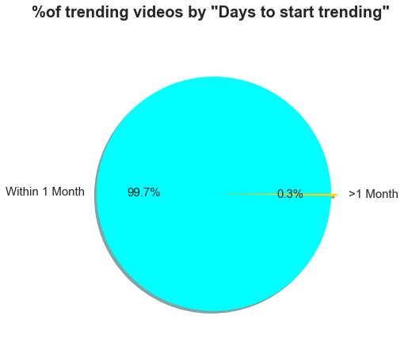

However, given that a latebloom video is trending, the chance of this video trends >5 days increases with its age !!

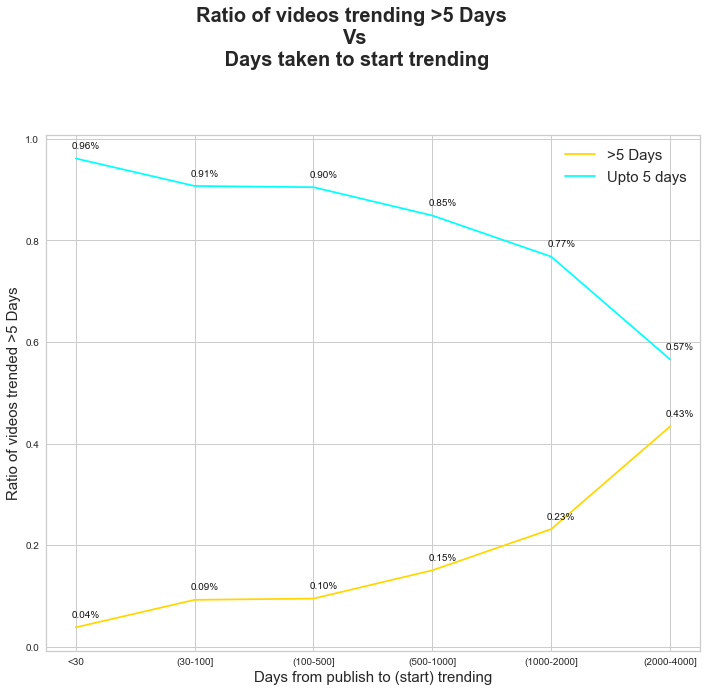

 

